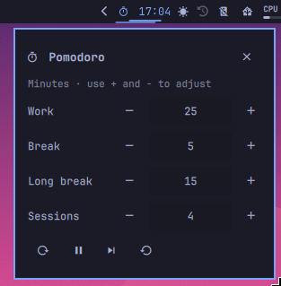

# omapom — Pomodoro timer for Omarchy

Pomodoro timer as an [Omarchy](https://github.com/basecamp/omarchy) bar widget.

[](https://github.com/resn3t/omapom)



## Features

- Start/pause with left-click, skip with middle-click, settings with right-click
- Configurable work, break, and long-break durations
- Tracks completed sessions before auto-promoting to a long break
- Theme-adaptive bar icon that shows the current phase and remaining time
- Local-AI break alerts: plays a notification sound and offers a short reminder

## Usage

Install as a local plugin:

```bash
git clone https://github.com/resn3t/omapom.git
cp -r omapom ~/.config/omarchy/plugins/local.pomodoro
```

Then restart the Omarchy shell (`omarchy restart shell`). Add the widget to
your bar configuration via `omarchy edit shell` or by editing
`~/.config/omarchy/shell.json`.

Right-click the bar icon to open the settings popup.

## Build / Development

No build step — the plugin is pure QML + a small Bash helper.

## License

MIT
